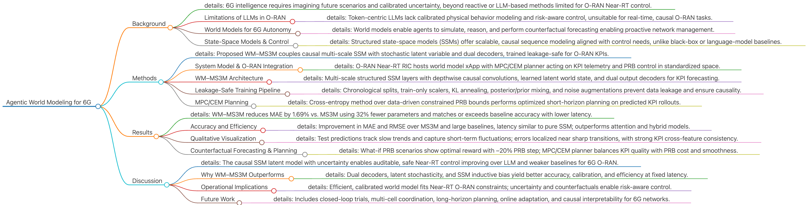

# Agentic World Modeling (WM–MS³M)


This repository contains the reference implementation of **WM–MS³M** from the paper:

> **Agentic World Modeling for 6G O-RAN: Near-Real-Time Generative State-Space Reasoning**  
> Farhad Rezazadeh, Hatim Chergui, Merouane Debbah, Houbing Song, Dusit Niyato, and Lingjia Liu.
> [arXiv:2511.02748](https://arxiv.org/abs/2511.02748)

WM–MS³M is an **agentic world model** for 6G O-RAN that combines:

- A **strictly causal multi-scale structured state-space mixture** (MS³M) backbone  
- A **compact stochastic latent** (world state)  
- **Dual decoders** (full KPI frame + heteroscedastic target head with AR skip)  
- An **MPC / Cross-Entropy Method (CEM)** planner operating on short horizons  
- **Action-conditioned what-if rollouts** with calibrated uncertainty (PRBs as first-class actions)

The goal is to support **near-real-time, counterfactual, and uncertainty-aware control** in 6G O-RAN, treating *prediction/imagination* and *decision-making* as two cleanly separated steps.

---
## Paper at a Glance

The figure below summarizes the paper *Agentic World Modeling for 6G* as a high-level mind map.



---
**Resources:**

- 📄 Paper: [https://arxiv.org/abs/2511.02748](https://arxiv.org/abs/2511.02748)  
- 📊 Dataset (O-RAN KPIs): [Video Streaming Network KPIs for O-RAN Testing](https://ieee-dataport.org/documents/video-streaming-network-kpis-o-ran-testing)
- 🎧 Podcast: [Paper podcast (MP3)](media/Paper-Podcast.mp3)


---
## Key Ideas

- **Agentic world modeling**  
  - Learn a generative state-space model that can **predict** and **imagine** KPI trajectories under hypothetical PRB sequences.  
  - Use those rollouts to **choose** actions via MPC/CEM in the Near-RT RIC.

- **WM–MS³M architecture**  
  - Multi-scale, strictly causal SSM front-end (HiPPO–LegS-based depthwise kernels).  
  - Latent world state \( \mathbf{z} \) with KL-annealed prior/posterior (VAE-style).  
  - Dual decoders:  
    - Full next-step KPI frame (for representation & cross-KPI structure).  
    - Heteroscedastic target head (e.g., RSRP) + bounded AR skip from last KPI.

- **Leakage-safe, unit-aware training**  
  - Chronological splits, train-only scalers, no bidirectional leakage.  
  - Feature-channel dropout + light Gaussian input noise.  
  - Posterior/prior mixing and KL annealing for stable latent usage.

- **Planning in standardized space**  
  - MPC/CEM over a short horizon \( H \), with PRBs constrained to train-derived bounds.  
  - Reward trades SINR/SE/RSRP vs BLER/Delay/PRB cost + smoothness penalty.  
  - Actions are optimized in scaled space then mapped back to physical PRB units.

---

## Performance (High-Level)

On realistic O-RAN traces, WM–MS³M:

- Improves **MAE by ~1.69%** vs. a strong MS³M baseline  
- Uses **~32% fewer parameters** with similar inference latency  
- Achieves **35–80% lower RMSE** than attention/hybrid baselines  
- Runs **2.3–4.1× faster** at inference under Near-RT constraints  

Beyond metrics, it enables:

- **What-if PRB analysis** (e.g., “what if we reduce PRBs by 20% for the next 8 steps?”)  
- **Offline policy screening** and rare-event simulation  
- **Agentic Near-RT control** via MPC/CEM over calibrated world-model predictions

---

Planned workflow:

1. **Install** the environment (PyTorch and common TS/SSM dependencies).  
2. **Prepare data**: O-RAN KPI traces with PRB, SINR, RSRP, BLER, Delay, SE, etc.  
3. **Train WM–MS³M** on chronological splits with leakage-safe preprocessing.  
4. **Run inference** for KPI forecasting and uncertainty estimation.  
5. **Run planner (MPC/CEM)** for near-real-time PRB control or offline policy evaluation.

---

## Repository structure

```text
wm_ms3m_github/
├── src/
│   └── wm_ms3m/
│       ├── __init__.py
│       └── core.py          # WM--MS3M model, training loop, and CEM planner
├── scripts/
│   └── train_wm_ms3m.py     # Command-line entry point for training
├── data/
│   └── README.md            # Notes about expected data format
├── requirements.txt
└── LICENSE
```

## Data format

Place your preprocessed datasets as:

- `data/x.npy` with shape **(N, L, F)**: rolling windows of past KPIs
- `data/y.npy` with shape **(N, F)**: next-step KPI for each window

The feature dimension **F** must match the ordering in `WMMS3MConfig.feature_names`:

```python
(
    "MCS", "CQI", "RI", "PMI", "Buffer", "PRBs",
    "RSRQ", "RSRP", "RSSI", "SINR", "SE", "BLER", "Delay"
)
```

By default, **PRBs** at index 5 are treated as the action channel, and **RSRP** at index 7 is
used as the main prediction target (while the model reconstructs all KPIs in scaled space).

## Installation

You can use this project as a pure script-style repo:

```bash
pip install -r requirements.txt
export PYTHONPATH=src:$PYTHONPATH
```

or add `src/` to your interpreter path in your IDE.

## Training

Once `x.npy` and `y.npy` are in the `data/` directory:

```bash
python scripts/train_wm_ms3m.py --data-dir ./data --ckpt-dir ./artifacts
```

This will:

- Train the WM--MS3M model on the RSRP prediction task
- Save the best checkpoint and metrics to `./artifacts/`
- Export test-set predictions to `test_pred.npy` and ground truth to `test_true.npy`

## Using as a library

```python
from wm_ms3m import WMMS3MConfig, train_and_eval_wm_ms3m, wm_ms3m_cem_plan_next_prb

cfg = WMMS3MConfig()
cfg.data_dir = "./data"
cfg.ckpt_dir = "./artifacts"

bundle = train_and_eval_wm_ms3m(cfg)

# Example MPC-style CEM planning for the next PRB
# x_window_orig should be a (L, F) numpy array in original KPI units
# a0, diag = wm_ms3m_cem_plan_next_prb(bundle, x_window_orig)
```

---

## Citation

If you use this work in your research, please cite:

```bibtex
@article{rezazadeh2025agenticWMMS3M,
  title   = {Agentic World Modeling for 6G O-RAN: Near-Real-Time Generative State-Space Reasoning},
  author  = {Rezazadeh, Farhad and Chergui, Hatim and Debbah, Merouane and
             Song, Houbing and Niyato, Dusit and Liu, Lingjia},
  journal = {arXiv preprint arXiv:2511.02748},
  year    = {2025},
  url     = {https://arxiv.org/abs/2511.02748}
}
```

(A final BibTeX entry will be updated once the official venue is available.)

---

## License

This code is released under the MIT License (see `LICENSE`).

If you use this implementation in academic work, please consider citing the corresponding paper.

---

## Contact

For questions, collaborations, or feedback, please contact:

- **Farhad Rezazadeh** – `farhad.rezazadeh@upc.edu`

